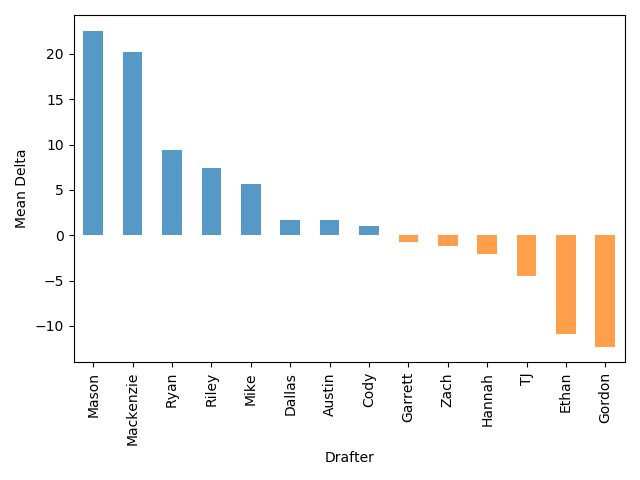

<table  class="dataframe">
  <thead>
    <tr style="text-align: left;">
      <th>Drafter</th>
      <th>Rating</th>
      <th>Mean</th>
      <th>Median</th>
      <th>Min</th>
      <th>Max</th>
      <th>Missing</th>
    </tr>
  </thead>
  <tbody>
    <tr>
      <td>Mason</td>
      <td>A+</td>
      <td>22.54</td>
      <td>19.0</td>
      <td>4</td>
      <td>64</td>
      <td>3</td>
    </tr>
    <tr>
      <td>Mackenzie</td>
      <td>A+</td>
      <td>20.15</td>
      <td>14.0</td>
      <td>4</td>
      <td>49</td>
      <td>3</td>
    </tr>
    <tr>
      <td>Ryan</td>
      <td>A</td>
      <td>9.42</td>
      <td>4.5</td>
      <td>-60</td>
      <td>80</td>
      <td>4</td>
    </tr>
    <tr>
      <td>Riley</td>
      <td>A</td>
      <td>7.40</td>
      <td>5.5</td>
      <td>-11</td>
      <td>43</td>
      <td>6</td>
    </tr>
    <tr>
      <td>Mike</td>
      <td>A</td>
      <td>5.62</td>
      <td>-1.0</td>
      <td>-20</td>
      <td>49</td>
      <td>3</td>
    </tr>
    <tr>
      <td>Dallas</td>
      <td>A</td>
      <td>1.73</td>
      <td>1.0</td>
      <td>-36</td>
      <td>36</td>
      <td>5</td>
    </tr>
    <tr>
      <td>Austin</td>
      <td>A</td>
      <td>1.69</td>
      <td>-7.0</td>
      <td>-25</td>
      <td>55</td>
      <td>3</td>
    </tr>
    <tr>
      <td>Cody</td>
      <td>A</td>
      <td>1.00</td>
      <td>7.0</td>
      <td>-28</td>
      <td>24</td>
      <td>6</td>
    </tr>
    <tr>
      <td>Garrett</td>
      <td>B</td>
      <td>-0.73</td>
      <td>1.0</td>
      <td>-40</td>
      <td>25</td>
      <td>5</td>
    </tr>
    <tr>
      <td>Zach</td>
      <td>B</td>
      <td>-1.18</td>
      <td>-3.0</td>
      <td>-35</td>
      <td>46</td>
      <td>5</td>
    </tr>
    <tr>
      <td>Hannah</td>
      <td>B</td>
      <td>-2.08</td>
      <td>-4.5</td>
      <td>-38</td>
      <td>43</td>
      <td>4</td>
    </tr>
    <tr>
      <td>TJ</td>
      <td>B</td>
      <td>-4.55</td>
      <td>2.0</td>
      <td>-42</td>
      <td>51</td>
      <td>5</td>
    </tr>
    <tr>
      <td>Ethan</td>
      <td>C</td>
      <td>-10.90</td>
      <td>-10.0</td>
      <td>-39</td>
      <td>9</td>
      <td>6</td>
    </tr>
    <tr>
      <td>Gordon</td>
      <td>C</td>
      <td>-12.27</td>
      <td>-15.0</td>
      <td>-37</td>
      <td>11</td>
      <td>5</td>
    </tr>
  </tbody>
</table>