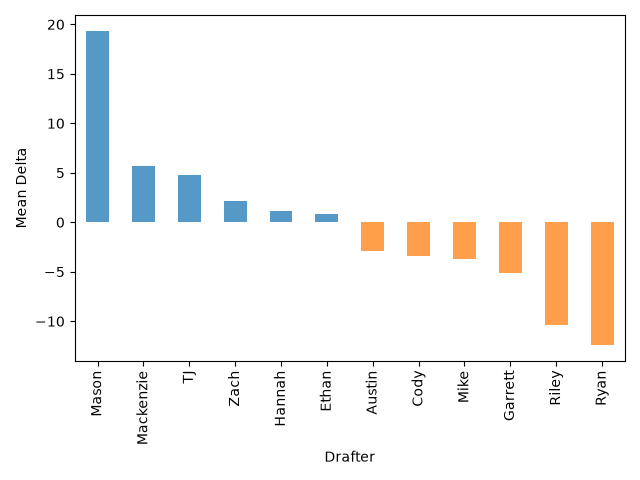

<table  class="dataframe draft-summary-table">
  <thead>
    <tr style="text-align: left;">
      <th>Drafter</th>
      <th>Rating</th>
      <th>Mean</th>
      <th>Median</th>
      <th>Min</th>
      <th>Max</th>
      <th>Missing</th>
      <th>Sum</th>
      <th>ADP Rating</th>
    </tr>
  </thead>
  <tbody>
    <tr>
      <td>Mason</td>
      <td>A+</td>
      <td>19.36</td>
      <td>14.5</td>
      <td>0</td>
      <td>46</td>
      <td>0</td>
      <td>271</td>
      <td>B</td>
    </tr>
    <tr>
      <td>Mackenzie</td>
      <td>A</td>
      <td>5.69</td>
      <td>2.0</td>
      <td>-17</td>
      <td>37</td>
      <td>1</td>
      <td>74</td>
      <td>B</td>
    </tr>
    <tr>
      <td>TJ</td>
      <td>B</td>
      <td>4.75</td>
      <td>3.0</td>
      <td>-22</td>
      <td>38</td>
      <td>2</td>
      <td>57</td>
      <td>A</td>
    </tr>
    <tr>
      <td>Zach</td>
      <td>D</td>
      <td>2.18</td>
      <td>1.0</td>
      <td>-23</td>
      <td>36</td>
      <td>3</td>
      <td>24</td>
      <td>D</td>
    </tr>
    <tr>
      <td>Hannah</td>
      <td>C</td>
      <td>1.17</td>
      <td>0.0</td>
      <td>-29</td>
      <td>36</td>
      <td>2</td>
      <td>14</td>
      <td>B</td>
    </tr>
    <tr>
      <td>Ethan</td>
      <td>B</td>
      <td>0.83</td>
      <td>4.5</td>
      <td>-62</td>
      <td>65</td>
      <td>2</td>
      <td>10</td>
      <td>A</td>
    </tr>
    <tr>
      <td>Austin</td>
      <td>C</td>
      <td>-2.92</td>
      <td>1.0</td>
      <td>-42</td>
      <td>35</td>
      <td>2</td>
      <td>-35</td>
      <td>C</td>
    </tr>
    <tr>
      <td>Cody</td>
      <td>F</td>
      <td>-3.42</td>
      <td>-0.5</td>
      <td>-30</td>
      <td>14</td>
      <td>2</td>
      <td>-41</td>
      <td>D</td>
    </tr>
    <tr>
      <td>Mike</td>
      <td>A</td>
      <td>-3.69</td>
      <td>-2.0</td>
      <td>-35</td>
      <td>29</td>
      <td>1</td>
      <td>-48</td>
      <td>A</td>
    </tr>
    <tr>
      <td>Garrett</td>
      <td>C</td>
      <td>-5.17</td>
      <td>-1.0</td>
      <td>-32</td>
      <td>15</td>
      <td>2</td>
      <td>-62</td>
      <td>B</td>
    </tr>
    <tr>
      <td>Riley</td>
      <td>D</td>
      <td>-10.42</td>
      <td>-6.0</td>
      <td>-59</td>
      <td>6</td>
      <td>2</td>
      <td>-125</td>
      <td>C</td>
    </tr>
    <tr>
      <td>Ryan</td>
      <td>D</td>
      <td>-12.42</td>
      <td>-18.5</td>
      <td>-54</td>
      <td>40</td>
      <td>2</td>
      <td>-149</td>
      <td>D</td>
    </tr>
  </tbody>
</table>